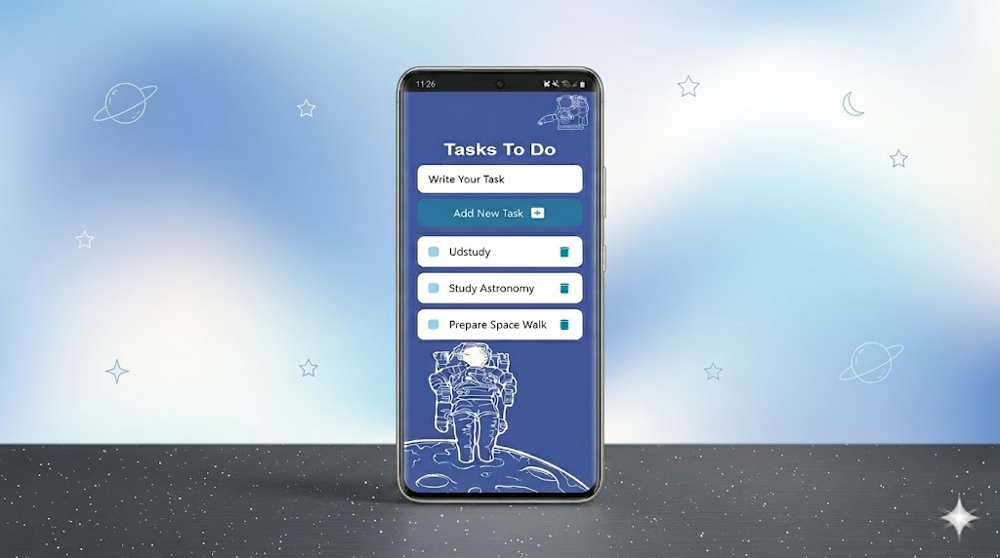

# Ustudy Final Project Task To-Do React Native\

## Preview

- Home




### Task To Do
    
  - [React Native App](https://github.com/x39OME/Ustudy-Final-Project-TaskToDo-React-Native/tree/main)
    ```
      ● Create a React Native Application
    ```
## Steps
- npm install
- npm start
- npm start -w

